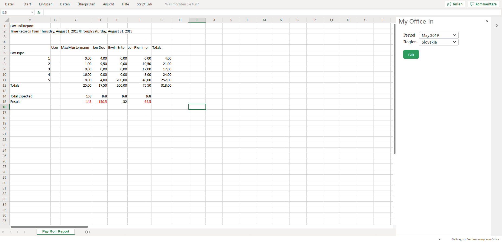

# Excel Report Generator



## Demo

👉 [https://sleepy-jennings-39e0ef.netlify.com/](https://sleepy-jennings-39e0ef.netlify.com/)

(You need to load the [`manifest.xml`](https://sleepy-jennings-39e0ef.netlify.com/manifest.xml) file into excel to try it out)

## Quickstart 🚀

```sh
git clone git@github.com:bitworkers-official/excel-report-generator.git &&
npm install &&
npm run dev
```

## ❗ Important: Https on Localhost

For local development you need trust the self signed certificate:

Go to `https://localhost:3000` and click Advanced and accept the risk
